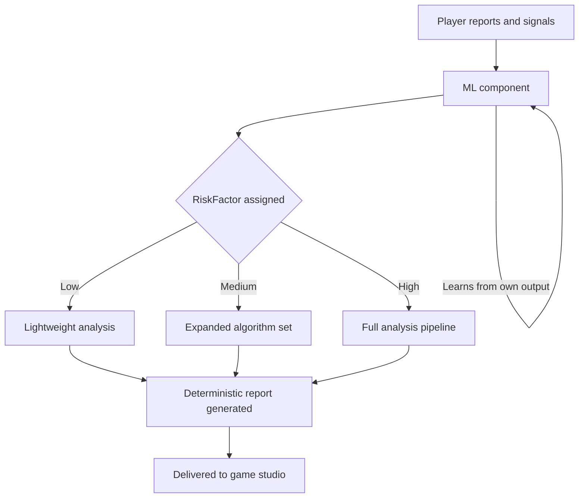
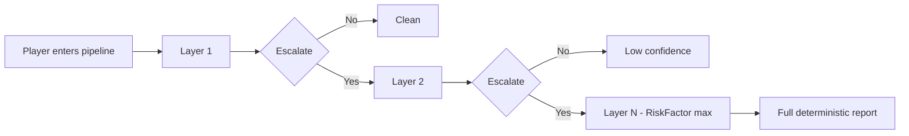

# Welcome to VigilanSee

VigilanSee is a server-side behavioral analysis service designed to accompany existing anti-cheat systems. Rather than targeting cheats directly, it focuses on detecting hidden patterns in player behavior, making it effective against both cheating and toxic behavior (griefing, friendly fire abuse, coordinated harassment, etc.).

The core philosophy is simple: no kernel-level software, no bloat, no data tied to real identities. A service that works for the community, not against it.

---

## How it works

When players accumulate reports, the pipeline activates. A ML component analyzes incoming signals, report volume, report content, statistical anomalies; and assigns each player a **RiskFactor**. This score determines how many resources are allocated to that player's analysis and which behavioral algorithms are run against them.

>The ML does not determine whether a player is banned or cleared — that decision belongs to the game studio. Its only role is to route players to the right algorithms as efficiently as possible.

---

## Analysis pipeline

Each player passes through progressive layers of behavioral analysis until their RiskFactor ceiling is reached. The algorithms cover anything measurable: aim patterns, movement, positioning decisions, interaction with teammates, and more.

>The pipeline is fully functional without the ML... It just runs broader and slower. The ML exists to make it precise and scalable across potentially millions of concurrent players.

---

## Privacy

All player data is encrypted and never associated with account identities. VigilanSee handles patterns, not people. In the event of a data breach, no information can be traced back to any existing account.

Data selling is out of the question.

---

## Reports

Game studios receive reports in whatever format fits their workflow, from full analytical breakdowns to minimal confidence scores. VigilanSee is designed to integrate with any game, for any studio, at any scale.
